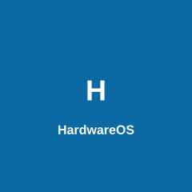

<p align="center">
  
</p>

<h1 align="center">HardwareOS</h1>

<p align="center">
  <strong>Multi-Tenant SaaS ERP & POS for Hardware Stores — East Africa</strong>
</p>

<p align="center">
  
  
  
  
  
</p>

---

## 🌍 Real-World Application & Problem Solving

Hardware stores in East Africa typically rely on fragmented, legacy workflows: physical paper ledgers, isolated desktop POS systems, manual inventory tracking, and disconnected debt collection. 

**HardwareOS solves these problems by providing:**
- **Centralized Inventory Control:** Preventing stockouts and employee theft through an immutable ledger, multi-branch tracking, and strict role-based access control (RBAC).
- **Offline Sync & Conflict Resolution:** Cashiers process sales seamlessly offline. Reconnected sync detects stock conflicts atomically and routes them to a manager "Pending Review" queue with partial fulfillment and override capabilities.
- **Dual Debt Management (Customer & Supplier):** Over 60% of hardware sales are on credit. HardwareOS mirrors customer credit ledgers with full supplier debt tracking, payment scheduling, and partial repayment processing.
- **Thermal Barcode Label Printing:** Instant vector Code128 thermal barcode label printing supporting 38mm, 58mm, and 80mm label rolls.
- **Automated Daily End-of-Day (EOD) Reports:** Automated 8:00 PM EAT business summaries detailing Revenue, Profit, M-Pesa vs Cash totals, Low Stock alerts, and Overdue Debts delivered via SMS and WhatsApp.
- **Server-Side Security & Feature Gating:** Zero direct client database writes. Strict Firestore security rules across 19+ collections and Cloud Function middleware enforcing plan boundaries.

---

## 📖 Deep System Overview & Architecture

HardwareOS is a robust, cloud-based ERP and POS platform specifically designed for hardware and building-material retailers in East Africa. It replaces fragmented legacy workflows with a unified omnichannel experience.

The system uses a **multi-tenant architecture**. Each registered hardware store operates within its own strictly isolated data environment under a tiered subscription plan. Simultaneously, platform owners govern the entire ecosystem through an omnipresent Super Admin control plane.

HardwareOS utilizes a highly secure **"Function-as-a-Service" (FaaS) data mutation pattern**. Client applications (Web, Android, Windows) have *zero* direct write access to the database. All mutations route through Firebase Cloud Functions (HTTPS Callables), which act as middleware to enforce authentication, business logic, role-based access control (RBAC), and plan limits.

---

## 🏗️ Architectural Topology

```text
┌─────────────────────────────────────────────────────────┐
│                      Flutter Client                     │
│    (Web / Android / Windows — Material 3 Design)        │
│                                                         │
│  State Management: Provider (Auth, Theme)               │
│  Offline Cache: Hive (Pending Sales, Conflicted Queue)  │
│  Routing: go_router (Auth guards, ShellRoutes)          │
└────────────────────────┬────────────────────────────────┘
                         │ 1. HTTPS Callable Requests
                         ▼
┌─────────────────────────────────────────────────────────┐
│               Firebase Cloud Functions (Node.js)        │
│                                                         │
│  [Auth] [Inventory] [Sales] [Supplier Debt] [Expenses]  │
│  [M-Pesa Billing] [Super Admin] [AI] [EOD Reports]      │
│  Middleware: assertBusinessMember, assertFeatureEnabled │
└────────────────────────┬────────────────────────────────┘
                         │ 2. Server-side Validation & Execution
                         ▼
┌─────────────────────────────────────────────────────────┐
│                   Cloud Firestore                       │
│  Strict Security Rules (Read-Only for Clients)          │
│                                                         │
│  Users | Businesses | Products | Sales | Expenses       │
│  SupplierDebts | Customers | Quotations | EOD History   │
└─────────────────────────────────────────────────────────┘
```

---

## 🏃 Quick Start & How to Use the System

1. **Onboarding:** A hardware store owner registers their business, initiating a 14-day Pro trial.
2. **Inventory Setup:** Upload existing products via Bulk Import (CSV/Excel) or add products with images, UOMs, and reorder levels.
3. **Team Management:** Invite Cashiers and Managers via email. RBAC enforces operational boundaries.
4. **Daily Operations:**
   - **Sales/POS:** Scan items, attach customer credit, or issue digital receipts.
   - **Offline Sync:** Process offline transactions during internet drops; resolve stock conflicts via the Sync Conflicts dashboard.
   - **Barcode Printing:** Print price labels directly from product screens or settings.
   - **Supplier Debt:** Track payables, log partial payments, and view overdue debt cards.
5. **EOD Summaries & AI Analytics:** Receive automated daily EOD reports at 8:00 PM EAT and use the Gemini AI Assistant for inventory forecasting.

---

## 🚀 Core Modules & Capabilities

### 1. Point of Sale (POS) & Offline Conflict Resolution
- **Omni-platform POS**: Fast checkout interface supporting barcode scanning and manual search.
- **Offline Resilience & Conflict Queue**: Sales are queued offline in Hive. Upon reconnecting, stock shortages trigger a structured `CONFLICT:` error and route to `ConflictResolutionScreen` for **Partial Fulfillment**, **Sale Cancellation**, or **Manager Override**.
- **Payment Methods**: Cash, M-Pesa, Bank Transfer, and Credit.

### 2. Comprehensive Inventory & Supply Chain
- **Immutable Inventory Ledger**: Double-entry style immutable ledger tracking all stock movements (Sales, Purchases, Returns, Adjustments).
- **Product Management & Images**: High-resolution primary `imageUrl` and gallery support.
- **Unit of Measure (UOM)**: Tracks `baseUnit`, `purchaseUnit`, `sellingUnit`, and dynamic conversion multipliers.
- **Batch & Serial Tracking**: Perishable goods (paint, cement) FIFO batch tracking and serial number warranties.

### 3. Thermal Barcode Label Printing
- **Label Customization**: Configure paper sizes (`38mm × 25mm`, `58mm × 30mm`, `80mm × 40mm`).
- **Field Toggles**: Toggle store name, SKU, price, and barcode rendering.
- **Vector PDF Thermal Engine**: Instant high-resolution Code128 PDF label output.

### 4. Supplier Debt Tracking & Payables
- **Supplier Debt Model**: Track total amount, amount paid, outstanding balance, and due dates.
- **Payment Ledger**: Record partial or full payments via M-Pesa, Cash, or Bank Transfer with automated supplier balance deductions.
- **Payable Dashboards**: Total Payables, Overdue Payables, and Overdue Count cards.

### 5. Automated Daily End-of-Day (EOD) Summary Report
- **Scheduled Cron (`0 17 * * *`)**: Daily automated report at 8:00 PM EAT.
- **Aggregated Business Metrics**: Revenue, Profit, Transaction count, M-Pesa vs Cash totals, Low Stock alerts, Expenses, Customer Debt, and Supplier Payables.
- **Delivery Channels**: Multi-channel delivery via SMS (Africa's Talking) and WhatsApp (Meta API).

### 6. CRM & Customer Credit Ledgers
- **Customer Directory**: Track contact info, loyalty points (1 pt per 100 KES), and Fundi badges.
- **Credit Ledgers & Statements**: Track credit limits, available credit, and generate PDF account statements.

### 7. Double-Entry Accounting & HR Payroll
- **General Ledger**: Chart of Accounts with real-time Trial Balance.
- **HR & Payroll Engine**: Statutory deductions (PAYE, NHIF, NSSF) linked directly to accounting liabilities.

### 8. Gemini AI Business Analyst & Autonomous Workflows
- **Senior Retail Analyst Intelligence**: Advanced Cloud Function endpoint (`runAIBusinessAnalyst`) powered by Google Gemini API. Analyzes real-time sales velocity, product run-out dates, profit variances, supplier performance, and detects inventory shrinkage anomalies.
- **Executive Analytical Workflows**:
  - *"Which products will run out next week?"*
  - *"Why did profit decrease this month?"*
  - *"Which supplier should I reorder from?"*
  - *"Detect suspicious inventory adjustments."*
  - *"Forecast next month's revenue."*
  - *"Recommend optimal reorder quantities (EOQ)."*
- **Autonomous Workflow & Human Approval Gate**: The AI Analyst generates structured action proposals (e.g. `draft_purchase_order`, `update_reorder_level`). Managers inspect and approve proposed actions via a one-click human-in-the-loop gate (`approveAIDraftedAction`), automatically creating official purchase order documents without manual typing.

---

## 🔒 Security Hardening & Data Integrity

1. **Explicit Firestore Rules**: Explicit role-appropriate rules across 19+ collections (`customers`, `debtTransactions`, `quotations`, `purchase_orders`, `employees`, `stockAdjustments`, `returns`, `accountingEntries`, `suppliers`).
2. **Server-Side Feature Gating**: Cloud Function middleware (`assertFeatureEnabled`) enforcing plan permissions on AI, WhatsApp, Storefront, and Advanced Analytics endpoints.
3. **Double-Entry Ledger Integrity**: Stock mutations executed atomically inside Firestore transactions.

---

## 🧪 Unit Testing Suite

The repository includes a comprehensive unit test suite:
- `test/models/customer_test.dart`: Verifies credit limits, `availableCredit`, `isOverLimit`, and parsing.
- `test/models/sale_test.dart`: Verifies loyalty point math and line total calculations.
- `test/models/product_test.dart`: Verifies stock status indicators (`isLowStock`, `isOutOfStock`, `margin`).
- `test/services/feature_access_service_test.dart`: Verifies plan feature access and grace period restrictions.

Run tests using:
```bash
flutter test
```

---

## 🛠️ Technology Stack

| Layer | Technology |
|---|---|
| **Frontend UI/UX** | Flutter 3.38, Dart 3.10, Material 3, fl_chart |
| **State & Offline Storage** | Provider, Hive |
| **Routing** | go_router |
| **Backend Logic** | Firebase Cloud Functions v2 (Node.js, TypeScript) |
| **Database** | Cloud Firestore (NoSQL) |
| **Authentication** | Firebase Auth (Email/Password) |
| **Integrations** | Safaricom M-Pesa Daraja API, Africa's Talking SMS, Meta WhatsApp Business API |
| **AI Engine** | Google Gemini LLM API |

---

## ⚙️ Local Setup & Deployment

```bash
# 1. Clone the repository
git clone https://github.com/MartinMuraya/hardwareos.git
cd hardwareos

# 2. Install Flutter dependencies
flutter pub get

# 3. Install Cloud Functions dependencies
cd functions
npm install
cd ..

# 4. Run Unit Tests
flutter test

# 5. Run the Flutter App
flutter run -d chrome
```

---

## 📝 License
This project is proprietary software belonging to Martin Muraya. All rights reserved.
